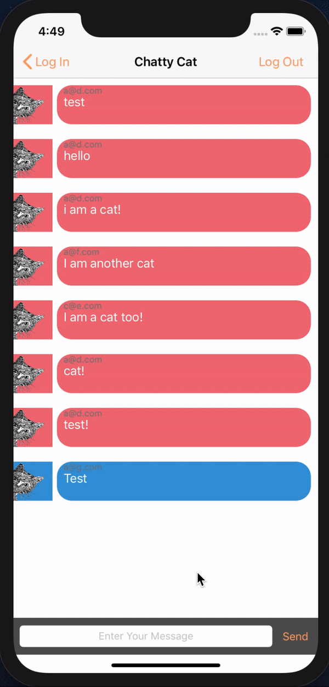

# Cat Themed Chat App
Application completed to learn Swift programming while integrating a firebase instance for authentication and chat sharing. 

## Description
Using Swift, Xcode and Firebase to build a chat application where users can sign up, login and chat.

## Sample User Flow

## Features

* Sign Up/Login (Username and Password stored and retrieved using firebase)
* Chat functionality between limited users

## Future Functionality
- Allow for users to view own photos as well as others
- Allow for geolocation functionality

## Known Issues or Bugs
- Keyboard dissapears on some devices  

